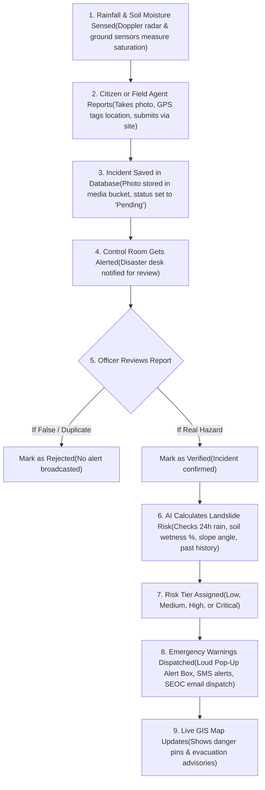

# North Eastern Region (NER) Landslide Early Warning & Risk Monitoring System
## Complete Beginner-Friendly System Guide: Features, Workflows, APIs & Database Setup

---

## 1. What is this Project in Simple Words?

In the hilly North Eastern States of India (*Meghalaya, Assam, Mizoram, Nagaland, Arunachal Pradesh, Sikkim, Manipur, and Tripura*), torrential monsoon rains frequently trigger dangerous mountain landslides, rockfalls, and road washouts. These disasters cut off essential roads, damage hillside houses, and put lives at risk.

This platform is a **complete smart early warning web system**. It combines satellite imagery, underground moisture telemetry, and Artificial Intelligence (AI) to detect when a hill is becoming dangerously unstable and immediately warn citizens and authorities before a collapse occurs.

### What the System Solves:
- **Citizen Incident Reporting**: Anyone with a smartphone can photograph a slope fissure, road crack, or mudflow, capture their GPS location automatically, and send it directly to disaster control rooms.
- **Officer Verification**: Disaster management staff review photos on a dashboard and verify them with one click.
- **Smart AI Risk Prediction**: Calculates landslide danger (*Low, Medium, High, or Critical*) based on rainfall, soil wetness, slope steepness, and historical data.
- **Emergency Pop-Up Alert Box**: When danger is severe, an urgent red warning box immediately pops up on screen with protective actions and a direct 1-tap call to the **1070** toll-free emergency helpline.
- **Public Live GIS Map & Radar**: Anyone can view live hazard pins across all 8 states and check 7-day rainfall forecasts without logging in.

---

## 2. How the Complete System Works (End-to-End Workflow)



### Step-by-Step Explanation:

#### A. Data Collection & Citizen Reporting
1. A citizen or field volunteer spots a road crack or mud slippage and opens **Report Incident** (`/citizen/report`).
2. They select the incident type (*Landslide, Slope Crack, Road Blockage, Flooding*) and severity (*Minor, Moderate, Severe*).
3. The phone's GPS automatically captures the exact latitude and longitude.
4. They upload a photo or video as evidence.
5. Upon submission, the media is saved into the cloud storage bucket, the report is saved with status **Pending**, and the emergency desk is notified.

#### B. Officer Verification
1. Duty officers open the **Reports Management** console (`/admin/reports`).
2. They inspect the photo, GPS coordinates on the map, and description.
3. If genuine, they click **Verify**. The status changes to **Verified**, immediately alerting emergency response teams.

#### C. AI Risk Prediction Engine
1. The AI model gathers 4 simple indicators:
   - **24-Hour Rainfall (35% weight)**: Millimeters of rain accumulated in the last 24 hours.
   - **Soil Moisture Saturation (25% weight)**: How saturated the soil is with underground pore water.
   - **Slope Angle (25% weight)**: Steepness of the hillside in degrees (>35° is high risk).
   - **Past Landslide History (15% weight)**: Number of historical incidents in the past 10 years.
2. The model assigns a clear hazard tier:
   - **Low (Green)**: Safe baseline conditions.
   - **Medium (Blue)**: Advisory watch; monitor local weather.
   - **High (Amber)**: Dangerous; slope movement and creep detected.
   - **Critical (Red)**: Severe danger; acute structural collapse risk, immediate evacuation recommended.
3. It generates plain-English explanations like: *"Heavy downpour (115mm/24h) exceeding safety threshold on 42° slope"*.

#### D. Emergency Pop-Up Alert Box
1. When a Critical Alert or severe incident is active, a loud, high-priority **Emergency Pop-Up Alert Box** appears on the screen.
2. It features:
   - Pulsing red beacon and optional emergency audible siren.
   - Clear protective instructions (evacuation radius, alternative detour routes).
   - Direct 1-tap call button to the State Disaster Helpline (**1070** / **112**).
   - Direct navigation to the **Safety Guide & Go-Bag Checklist** (`/safety`) and **Live GIS Map** (`/map`).

---

## 3. Guide to All Pages on the Website

### A. Public Pages (Accessible to Everyone without Login)
1. **Home Page (`/`)**: Hero section with real-time sensor counters (87 stations, 8 states), 8-state regional hazard overview index, interactive map preview, live Doppler weather widget, and an **Interactive AI Risk Simulator** where users can drag sliders to see live AI predictions.
2. **Live GIS Risk Map (`/map`)**: Full-screen interactive Leaflet map showing all monitored slopes with color-coded pins (Critical, High, Medium, Low), search by hill name, and district filters.
3. **Weather Radar (`/weather`)**: Real-time 24-hour rainfall gauges for all 8 North East state capitals, soil saturation ratio (%), failure vulnerability score, and 7-day quantitative precipitation forecast.
4. **Emergency Alerts Bulletin (`/alerts`)**: Public noticeboard for official Red, Orange, and Yellow advisories issued by state authorities with 1-click sharing and pop-up alert triggers.
5. **Safety & Evacuation Guide (`/safety`)**: Teaches citizens 6 early warning indicators, a 3-step action guide (Before, During, After), and an **interactive 72-Hour Emergency Go-Bag checklist**.
6. **About the System (`/about`)**: Explains the sensor instruments (piezometers, inclinometers, IMD radar, Sentinel-1 satellites) and institutional partners.

### B. Citizen Portal
- **Citizen Report (`/citizen/report`)**: Form to submit photos, GPS, and severity of new incidents.
- **My Reports (`/citizen/my-reports`)**: Citizen dashboard to check if submitted reports are Pending, Verified, or Resolved.
- **Citizen Map (`/citizen/map`)**: Local map view focused on the user's home district.

### C. Admin Console (For Disaster Management Staff)
- **Dashboard (`/admin/dashboard`)**: Summary cards (Active Alerts, High Risk Zones, Reports Today), risk charts, and live operational embedded GIS map.
- **AI Model Console (`/admin/ai-model`)**: **Live Prediction Workbench** where officers select any monitored hill, adjust rainfall, and run live inference against the Python AI microservice.
- **Reports Verification (`/admin/reports`)**: Verify or reject citizen reports.
- **User Management (`/admin/users`)**: Manage officers and field agents.

---

## 4. Technology Stack

| Layer | Tool | What it Does in Simple Terms |
| :--- | :--- | :--- |
| **Frontend** | **React + Vite** | Builds the fast, interactive web pages that users see in their browser. |
| **Styling** | **Tailwind CSS** | Styles the site to look modern, clean, and responsive on both mobile and desktop. |
| **Maps** | **Leaflet + OpenStreetMap** | Displays live street and satellite maps with interactive pins and hazard circles. |
| **Backend API** | **Node.js & Express** | The main server engine that handles requests, sends SMS/notifications, and connects to the database. |
| **AI / Machine Learning** | **Python & FastAPI** | The calculation microservice that runs the weighted geotechnical risk scoring engine on port `8000`. |
| **Database & Cloud Storage** | **Supabase (PostgreSQL)** | Safely stores user logins, landslide locations, reports, and uploaded incident photos in the cloud. |

---

## 5. API Reference

All services communicate through clean REST endpoints:

| Method | Link (Endpoint) | Purpose |
| :--- | :--- | :--- |
| **`GET`** | **`/api/health`** | Verifies backend server health and uptime. |
| **`GET`** | **`/api/weather/:district`** | Fetches live rainfall (mm) and 7-day forecast for any North East district. |
| **`POST`** | **`/api/predict`** | Public endpoint that forwards coordinates and rainfall to the Python AI service. |
| **`POST`** | **`/api/admin/ai-model/predict`** | Admin endpoint that resolves location data and returns AI risk score, confidence, and factors. |
| **`GET`** | **`/api/admin/dashboard/stats`** | Aggregates live statistics for active alerts, monitored hills, and report counts. |
| **`PATCH`** | **`/api/admin/reports/:id/verify`** | Approves (Verify) or declines (Reject) a citizen incident report. |
| **`POST`** | **`/api/alerts/send`** | Dispatches emergency SMS and push alerts to a specific district. |
| **`POST`** | **`http://127.0.0.1:8000/predict`** | Direct Python FastAPI endpoint calculating geotechnical risk levels. |

---

## 6. Database Setup in Supabase

The database consists of 3 tables and 1 storage folder:
1. **`users` Table**: Stores people who access the system (*Admin, District Officer, Field Agent, Citizen*).
2. **`locations` Table**: Stores known landslide hotspots with coordinates and current risk levels across the 8 NE States.
3. **`reports` Table**: Stores citizen reports with photos, GPS, descriptions, and verification status.
4. **`incident-media` Storage Bucket**: A cloud storage bucket for uploaded incident photos and videos up to 50MB.

> [!TIP]
> The full database script is ready in [`supabase_schema.sql`](file:///c:/Users/harsh/Desktop/Landslide-Risk-Monitoring/supabase_schema.sql). Simply paste it into your Supabase **SQL Editor** and click **Run**.

---

## 7. How to Run the Project Locally

### Quickest Way (From Workspace Root):
```bash
npm run dev
```
*This starts the website at `http://localhost:5173`.*

### Starting All 3 Services Separately:

1. **Start the Backend API (Node.js)**:
   ```bash
   cd backend
   node server.js
   ```
   *Runs on `http://localhost:5000`.*

2. **Start the AI Service (Python FastAPI)**:
   ```bash
   cd ml-services
   python -m uvicorn app.main:app --port 8000
   ```
   *Runs on `http://localhost:8000`.*

3. **Start the Frontend (React / Vite)**:
   ```bash
   cd frontend
   npm run dev
   ```
   *Open `http://localhost:5173` in your web browser.*
