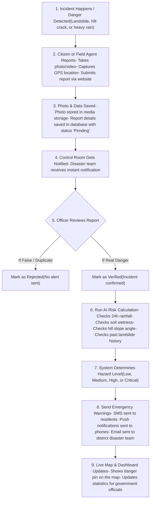

# Landslide Early Warning & Risk Monitoring System
## Complete System Guide: How It Works, Flowcharts, Tech Stack & APIs

---

## 1. What is this Project?

The **Landslide Early Warning & Risk Monitoring System** is a web platform built to protect people living in the hilly areas of North East India (*such as Meghalaya, Assam, Mizoram, Nagaland, and Arunachal Pradesh*).

In these regions, heavy rainfall during monsoon seasons frequently triggers dangerous landslides and road blockages. This platform solves that problem by:
- **Allowing Citizens to Report Incidents**: Anyone can take a picture of a landslide or road crack, tag their GPS location, and send it immediately to authorities.
- **Helping Officers Verify Reports**: Disaster management teams can review the photos and confirm whether the danger is real.
- **Using AI to Predict Landslide Risk**: The system looks at current rainfall, soil wetness, how steep the mountain is, and past landslide history to calculate a risk level (*Low, Medium, High, or Critical*).
- **Sending Instant Emergency Alerts**: If a landslide is confirmed or risk is critical, the system sends SMS warnings and push notifications to people and district officers.

---

## 2. How the System Works (End-to-End Workflow)

Here is how the entire system works from the moment a danger appears to when people receive emergency alerts:

### Complete System Flowchart



---

### Step-by-Step Explanation of Each Workflow

#### A. Citizen Reporting Workflow
1. A citizen or field agent opens the **Report Incident** page on their mobile or computer.
2. They select what happened (*Landslide, Slope Crack, Road Blockage, or Flooding*) and choose how serious it looks (*Minor, Moderate, Severe*).
3. The phone's GPS automatically picks up the exact latitude and longitude.
4. They attach a photo or video as proof.
5. When they click **Submit**, the photo is saved into cloud storage, and the report is saved with the status **Pending**.
6. A notification is immediately sent to the emergency control room.

#### B. Officer Verification Workflow
1. The disaster control room officer opens the **Reports Management** screen.
2. They see a list of newly submitted reports.
3. The officer checks the uploaded photo, location on the map, and description.
4. If the report is genuine, the officer clicks **Verify**.
5. Once verified, the status changes to **Verified**, and the system automatically notifies district officers to take action.

#### C. AI Risk Prediction Workflow
1. The system or an officer wants to know the landslide risk for a specific hill or district.
2. The AI model gathers 4 simple indicators:
   - **Rainfall (35% importance)**: How much rain fell in the last 24 hours.
   - **Soil Wetness (25% importance)**: How saturated the ground is with water.
   - **Hill Slope (25% importance)**: How steep the mountain side is.
   - **Past Landslide History (15% importance)**: How many times landslides happened there before.
3. The AI combines these numbers and assigns a simple risk level:
   - **Low**: Safe conditions.
   - **Medium**: Caution advised; monitor weather.
   - **High**: Dangerous; slope movement possible.
   - **Critical**: Extremely dangerous; immediate evacuation or road closure recommended.
4. It also provides easy-to-read explanations like: *"Heavy rainfall exceeding safety threshold"* or *"Steep terrain promotes fast soil movement"*.

#### D. Emergency Alert Workflow
1. When an incident is verified or risk is Critical, the control room triggers an alert.
2. The system dispatches:
   - **SMS Messages**: Sent directly to phone numbers in the affected district.
   - **Web Push Notifications**: Pop-up alerts sent to subscribers' phones or browsers.
   - **Emails**: Sent to district disaster officers and local response teams.

---

## 3. Technology Stack (Tools Used)

Only the essential tools used to build the platform are listed below:

| Layer | Tool | What it Does (Simple Description) |
| :--- | :--- | :--- |
| **Frontend (User Interface)** | **React** | Builds the web pages, buttons, forms, and interactive screens. |
| | **Tailwind CSS** | Styles the website to make it look clean, modern, and mobile-friendly. |
| | **Leaflet Maps** | Displays interactive maps showing landslide locations, danger pins, and user GPS coordinates. |
| | **Chart.js** | Draws simple graphs and charts showing risk trends and incident statistics. |
| **Backend (Server & Logic)** | **Node.js & Express** | The main engine that connects the website to the database, handles requests, sends notifications, and coordinates all services. |
| **AI / Machine Learning** | **Python & FastAPI** | The intelligent risk scoring service that takes weather, soil, and slope numbers to calculate landslide danger levels. |
| **Database & Cloud Storage** | **Supabase (PostgreSQL)** | Safely stores all user accounts, landslide locations, and citizen reports. |
| | **Supabase Storage** | Cloud folder that holds all uploaded photos and videos of landslide incidents. |

---

## 4. Project Folders (Where Everything Lives)

Here is a quick overview of how the project files are organized:

- **`frontend/`**: The complete website that users and admins see in their browser.
  - `src/pages/`: Contains all screens (Home page, Login, Citizen reporting pages, and Admin dashboard).
  - `src/components/`: Reusable pieces like maps, charts, buttons, and navigation bars.
  - `src/services/`: Functions that send and fetch data from the backend and database.
- **`backend/`**: The Node.js server that runs in the background.
  - `src/routes/`: Defines the web links (APIs) for reports, weather, alerts, and admin actions.
  - `src/controllers/`: The logic for what happens when an API is called.
  - `src/providers/`: Services that fetch live weather data, send SMS, and dispatch push alerts.
- **`ml-services/`**: The Python AI service.
  - `app/services/risk_scoring.py`: The formula that calculates the risk score (Low, Medium, High, Critical).
  - `app/routers/predict.py`: The API that receives location and weather data and returns the risk prediction.
- **`supabase_schema.sql`**: The database setup file containing the tables and security rules.

---

## 5. Database Structure (How Data is Stored)

The database uses simple tables to store information:

### 1. Users Table
Stores people who can access the system.
- **Name**: Person's full name.
- **Email**: Their login email.
- **Role**: What kind of user they are (*Admin, District Officer, Field Agent, or Citizen*).
- **District**: The district they belong to (e.g., Shillong, Kohima, Aizawl).
- **Status**: Whether the account is Active or Inactive.

### 2. Locations Table
Stores known landslide spots and hills that are being monitored.
- **Name**: Name of the hill, road, or area (e.g., *Nongthymmai Ridge*).
- **District**: District name.
- **Latitude & Longitude**: GPS coordinates of the hill.
- **Risk Level**: Current danger level (*Low, Medium, High, or Critical*).
- **Status**: Whether it is currently being monitored or resolved.

### 3. Reports Table
Stores all incident reports submitted by citizens and field agents.
- **Incident Type**: What happened (*Landslide, Slope Crack, Road Blockage, or Flooding*).
- **District & GPS Coordinates**: Where it happened.
- **Description**: Details written by the citizen.
- **Media URL**: Link to the photo or video evidence.
- **Severity**: How bad it is (*Minor, Moderate, or Severe*).
- **Status**: Report status (*Pending, Verified, or Rejected*).

### 4. Media Storage (`incident-media`)
- A secure cloud storage folder where uploaded photos and videos are saved.
- Supports common image and video formats (JPEG, PNG, WebP, MP4).
- Limits file size to 50MB per upload.

### How Data Connects (In Simple Words)
- One **User** can submit multiple **Reports**.
- Each **Report** contains GPS coordinates that can be displayed next to monitored **Locations** on the map.
- When an admin **Verifies** a report, the status changes, and notifications are sent out immediately.

---

## 6. API Reference (Simple & Clear)

Here are the main web links (APIs) used by the system to perform tasks:

### 1. Report APIs
- **Verify or Reject Report**
  - **Link**: `PATCH /api/admin/reports/:id/verify`
  - **What it does**: Allows an admin to approve (Verify) or decline (Reject) a citizen report.
  - **Extra info**: If verified, it automatically triggers emergency alerts to district officers.

- **Citizen Report Notification**
  - **Link**: `POST /api/citizen/reports/notify`
  - **What it does**: Informs the control room that a citizen just submitted a new report.
  - **Extra info**: Sends an email and notification to the duty desk so they review it quickly.

### 2. AI Risk Prediction API
- **Calculate Landslide Risk**
  - **Link**: `POST /api/admin/ai-model/predict`
  - **What it does**: Passes a location's coordinates and rainfall to the AI engine to calculate whether the risk is Low, Medium, High, or Critical.
  - **Extra info**: Automatically looks up local rainfall if not provided by the user.

### 3. Emergency Alert API
- **Send District Alert**
  - **Link**: `POST /api/alerts/send`
  - **What it does**: Broadcasts an emergency SMS and push notification to people in a specific district.
  - **Extra info**: Used when a severe landslide or road blockage occurs.

### 4. Weather API
- **Get District Weather**
  - **Link**: `GET /api/weather/:district`
  - **What it does**: Fetches current rainfall in millimeters and a 7-day weather forecast for the chosen district.
  - **Extra info**: Used by both the public home page and the AI prediction engine.

### 5. Dashboard Summary API
- **Get Dashboard Statistics**
  - **Link**: `GET /api/admin/dashboard/stats`
  - **What it does**: Provides counts of active locations, pending reports, and risk levels.
  - **Extra info**: Powers the summary cards and charts on the admin dashboard.

### 6. System Health API
- **Check Server Status**
  - **Link**: `GET /api/health`
  - **What it does**: Confirms that the backend server is running and healthy.

---

## 7. How to Run the Project Locally

To run the whole project on your computer:

### 1. Database Setup
1. Log into your **Supabase** account.
2. Go to the **SQL Editor** and paste the code from [supabase_schema.sql](file:///c:/Users/harsh/Desktop/Landslide-Risk-Monitoring/supabase_schema.sql).
3. Click **Run** to create the tables, storage bucket, and sample data.

### 2. Start the Backend API (Node.js)
```bash
cd backend
npm install
npm run dev
```
*The backend will run on `http://localhost:5000`.*

### 3. Start the AI Service (Python)
```bash
cd ml-services
python -m venv venv

# On Windows:
venv\Scripts\activate
# On Mac/Linux:
source venv/bin/activate

pip install -r requirements.txt
uvicorn app.main:app --reload --port 8000
```
*The AI service will run on `http://localhost:8000`.*

### 4. Start the Frontend Website (React)
```bash
cd frontend
npm install
npm run dev
```
*Open `http://localhost:5173` in your web browser to use the website.*
