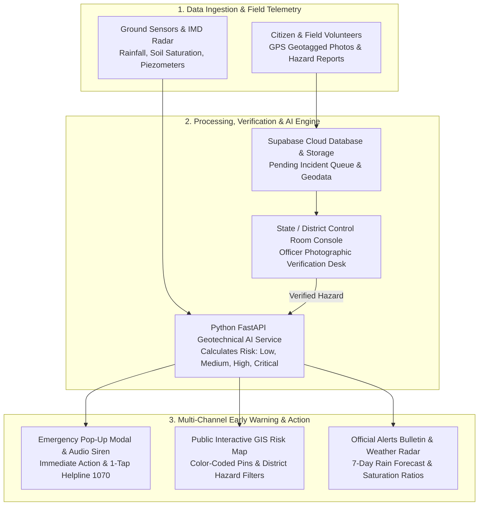

# 🏔️ North Eastern Region (NER) Landslide Early Warning & Risk Monitoring System

> **A Community-Empowered, Geotechnical AI-Driven Disaster Early Warning & Risk Assessment Platform for the North Eastern States of India.**

---

## 📌 Project Overview

In the hilly, ecologically sensitive North Eastern States of India (*Meghalaya, Assam, Mizoram, Nagaland, Arunachal Pradesh, Sikkim, Manipur, and Tripura*), torrential monsoon rainfall, steep slope geometry, and fragile geological strata trigger recurrent catastrophic landslides, slope failures, rockfalls, and road washouts. These natural disasters disrupt vital highway corridors, sever remote communities, destroy critical infrastructure, and endanger human lives every year.

This platform is a **smart, end-to-end landslide early warning and risk monitoring web application**. Built as part of a mission-critical Disaster Risk Reduction (DRR) initiative, it bridges ground geotechnical sensors, Doppler meteorological telemetry, citizen crowdsourced hazard reporting, and Artificial Intelligence (AI) to identify slope instability and dispatch life-saving alerts **before** catastrophic failure occurs.

---

## 🎯 Main Objective of the Application

The primary objective of this application is to **reduce loss of life and infrastructure damage from rainfall-induced landslides across the 8 North Eastern states** by:

1. **Early Risk Detection & Assessment**: Fusing real-time precipitation telemetry, underground soil pore-water saturation, slope angles, and historical disaster records into an AI-powered geotechnical scoring model to predict slope instability hours ahead.
2. **Crowdsourced Hazard Intelligence**: Empowering citizens, commuters, and field agents to report nascent slope fissures, rock slippage, and drainage failures using smartphones with automated GPS tagging and photographic evidence.
3. **Rapid Verification Workflow**: Equipping disaster control rooms, district administrations, and State Emergency Operation Centres (SEOCs) with a real-time verification desk to vet crowd reports and mobilize rapid-response crews.
4. **Multi-Channel Emergency Alerting**: Broadcasting immediate, high-priority emergency notifications—featuring an urgent on-screen siren pop-up box, direct 1-tap state disaster helpline connectivity (**1070 / 112**), and district-level alert bulletins.
5. **Public Preparedness & Transparency**: Providing open, zero-barrier access to live 8-state GIS hazard maps, weather radars, 72-hour Go-Bag preparedness checklists, and an interactive AI risk simulator to enhance community resilience.

---

## 🏗️ End-to-End System Architecture & Workflow



---

## 🚀 Key Features & Application Portals

### 1. 🌐 Public Portal (Accessible to Everyone Without Login)
- **Home Dashboard (`/`)**: 
  - Live emergency alert ticker and real-time operational sensor counters (87 stations across 8 states).
  - 8-State Regional Landslide Hazard Index with instant danger ratings.
  - Interactive **AI Risk Simulator** allowing users to test how varying rainfall, soil moisture, and slope angles alter geotechnical failure probabilities.
  - Live Doppler weather summary and quick links to safety resources.
- **Live GIS Risk Map (`/map`)**: 
  - Full-screen interactive Leaflet map rendering color-coded hazard zones (*Critical, High, Medium, Low*).
  - Search by hill name, highway corridor, or state/district filter.
  - Granular slope details: slope inclination, soil moisture %, and historical incident count.
- **Weather Radar (`/weather`)**: 
  - Real-time 24-hour rainfall gauges for all 8 North Eastern state capitals.
  - Soil pore-water saturation ratios and 7-day quantitative precipitation forecasts.
- **Emergency Alerts Bulletin (`/alerts`)**: 
  - Official Red, Orange, and Yellow advisories issued by SEOCs.
  - Instant trigger for high-priority emergency modal previews and 1-click sharing.
- **Safety & Evacuation Guide (`/safety`)**: 
  - Educational guide identifying 6 early physical warning signs of slope failure.
  - Step-by-step action manuals: *Before*, *During*, and *After* a landslide.
  - Interactive **72-Hour Emergency Go-Bag checklist** with live progress tracking.
- **About the System (`/about`)**: 
  - Technical background on geotechnical sensors (inclinometers, piezometers, Sentinel-1 radar) and institutional partners.

### 2. 📱 Citizen Portal (`/citizen/*`)
- **Report Incident (`/citizen/report`)**:
  - Quick-submission form for citizens and field agents.
  - Incident category selection (*Landslide, Slope Crack, Rockfall, Mudflow, Road Blockage*).
  - Automated GPS coordinate detection (latitude, longitude, accuracy).
  - Direct photo and video upload up to 50MB to Supabase Storage.
- **My Reports Dashboard (`/citizen/my-reports`)**:
  - Personal tracking board showing lifecycle status of submitted incidents (*Pending Review*, *Verified*, *Rejected*, *Resolved*).
- **Citizen Local Map (`/citizen/map`)**:
  - Geofenced map view centered on the citizen’s local district for community situational awareness.
- **Citizen Profile (`/citizen/profile`)**:
  - Contact information and emergency alert preferences.

### 3. 🛡️ Disaster Management & Admin Console (`/admin/*`)
- **Operational Dashboard (`/admin/dashboard`)**:
  - Executive command metrics: Active Red Alerts, Monitored Slopes, New Incidents Today, Critical Zones.
  - Regional risk breakdown charts and live incident stream.
- **Reports Verification Desk (`/admin/reports`)**:
  - Duty officers inspect uploaded evidence photos, check map pins, and verify or dismiss reports with 1 click.
- **AI Prediction Workbench (`/admin/ai-model`)**:
  - Interactive console where officers select any monitored hill or input custom geotechnical metrics to run live inference against the Python AI microservice.
- **Hazard Zones & Landslides (`/admin/landslides`, `/admin/risk-management`)**:
  - Hotspot management, risk tier overrides, and evacuation perimeter definition.
- **User & Role Administration (`/admin/users`)**:
  - RBAC management for Administrators, District Officers, and Field Volunteers.

---

## 🧠 AI Geotechnical Hazard Scoring Engine

The risk prediction engine continuously evaluates 4 primary geotechnical indicators to determine hazard severity:

| Indicator | Weight | Scientific Rationale |
| :--- | :---: | :--- |
| **24-Hour Cumulative Rainfall** | **35%** | Intense short-term precipitation triggers rapid hydraulic pressure buildup in slope joints. |
| **Soil Moisture Saturation** | **25%** | High underground pore-water pressure drastically decreases soil shear strength. |
| **Slope Inclination Angle** | **25%** | Slopes steeper than 35° possess significantly higher gravitational driving shear stress. |
| **Historical Landslide Frequency** | **15%** | Past slope failures identify chronic fault lines, weathered rock, and unstable soil strata. |

### Standardized Hazard Tiers
- 🟢 **Low Risk (Green)**: Baseline geological stability; routine monitoring.
- 🔵 **Medium Risk (Blue)**: Advisory watch; increased saturation detected, monitor local forecasts.
- 🟡 **High Risk (Amber)**: Slope movement and creep detected; heightened alert, precautionary travel warnings.
- 🔴 **Critical Risk (Red)**: Imminent slope collapse threat; automated screen siren pop-up, urgent evacuation advisories, direct line to **1070**.

---

## 💻 Frontend Technology Stack

The frontend application is crafted with a focus on speed, responsiveness, accessibility, and high visual clarity:

- **Framework**: [React 19](https://react.dev/) + [Vite](https://vite.dev/) (Lightning-fast HMR and build performance)
- **Styling**: [Tailwind CSS 4](https://tailwindcss.com/) (Modern responsive styling with custom disaster color tokens)
- **Mapping & GIS**: [Leaflet](https://leafletjs.com/) & [React-Leaflet](https://react-leaflet.js.org/) (Interactive tile maps and custom markers)
- **Visualizations**: [Chart.js](https://www.chartjs.org/) & [React-ChartJS-2](https://react-chartjs-2.js.org/) (Real-time telemetry and risk distribution charts)
- **Icons**: [Lucide React](https://lucide.dev/) (Crisp, modern iconography)
- **Routing**: [React Router DOM v7](https://reactrouter.com/) (Multi-portal client-side routing)
- **Backend & Cloud Integration**: [@supabase/supabase-js](https://supabase.com/) (Realtime database, authentication, and media storage)

---

## 📁 Directory Structure

```plaintext
frontend/
├── public/                 # Static assets, icons, and map markers
├── src/
│   ├── assets/             # Brand logos, regional imagery
│   ├── components/         # Reusable UI components
│   │   ├── common/         # Navbar, Footer, Emergency Alert Box, Status Badges
│   │   ├── map/            # Leaflet map wrappers, legend, pin renderers
│   │   └── ui/             # Modals, buttons, stat cards, metric meters
│   ├── layouts/            # Public, Citizen, and Admin layout wrappers
│   ├── lib/                # Supabase client and third-party configuration
│   ├── pages/
│   │   ├── admin/          # Admin Dashboard, Reports Desk, AI Model Workbench
│   │   ├── citizen/        # Citizen Report, My Reports, Citizen Map, Signup
│   │   ├── public/         # LiveMap, WeatherRadar, AlertsBulletin, SafetyGuide, About
│   │   ├── Home.jsx        # Landing page with interactive AI simulator & statistics
│   │   └── Login.jsx       # Unified portal login
│   ├── services/           # API handlers (auth, report, landslide, geotech, prediction)
│   ├── App.jsx             # Route definitions and emergency alert provider
│   ├── index.css           # Tailwind CSS directives and global animations
│   └── main.jsx            # Application entry point
├── package.json            # Project dependencies and npm scripts
├── vite.config.js          # Vite config with API proxy to port 5000
└── README.md               # Frontend & project documentation
```

---

## 🛠️ Local Development & Setup

### Prerequisites
- **Node.js**: v18.0.0 or higher
- **npm**: v9.0.0 or higher
- *(Optional)* Backend API running on port `5000` & Python ML service on port `8000` for live end-to-end integration.

### 1. Installation
Navigate into the `frontend` directory and install dependencies:
```bash
cd frontend
npm install
```

### 2. Configure Environment Variables
Create a `.env` file in the `frontend/` directory by copying the sample:
```bash
cp .env.example .env
```
Fill in your Supabase project credentials:
```env
VITE_SUPABASE_URL=https://your-project-id.supabase.co
VITE_SUPABASE_ANON_KEY=your-anon-public-key
```

### 3. Start Development Server
```bash
npm run dev
```
The application will launch locally at `http://localhost:5173`.

### 4. Build for Production
To create an optimized production bundle:
```bash
npm run build
```
Preview the production build locally:
```bash
npm run preview
```

---

## 🔗 Multi-Service Integration

When running the full stack across all layers:

| Component | Directory | Port | Command |
| :--- | :--- | :---: | :--- |
| **Frontend** (React + Vite) | `frontend/` | `5173` | `npm run dev` |
| **Backend API** (Node.js + Express) | `backend/` | `5000` | `npm run dev` *(or `node server.js`)* |
| **AI / ML Service** (Python + FastAPI) | `ml-services/` | `8000` | `python -m uvicorn app.main:app --port 8000` |
| **Database & Storage** | Cloud / Local | `5432` | Supabase PostgreSQL schema in `supabase_schema.sql` |

> [!NOTE]
> The Vite development server is configured to automatically proxy requests from `/api/*` to `http://localhost:5000`.

---

## 🚨 Emergency Contacts & Helplines (North East Region)

- **State Disaster Management Authority (SDMA)**: **1070** *(Toll-Free)*
- **National Emergency Response Support System (ERSS)**: **112**
- **National Disaster Response Force (NDRF)**: **011-24363260**
- **India Meteorological Department (IMD) Cyclone/Rain Helpline**: **1800-180-1717**
